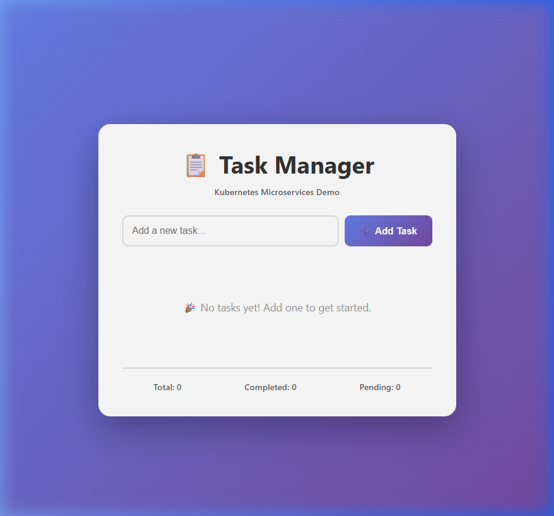
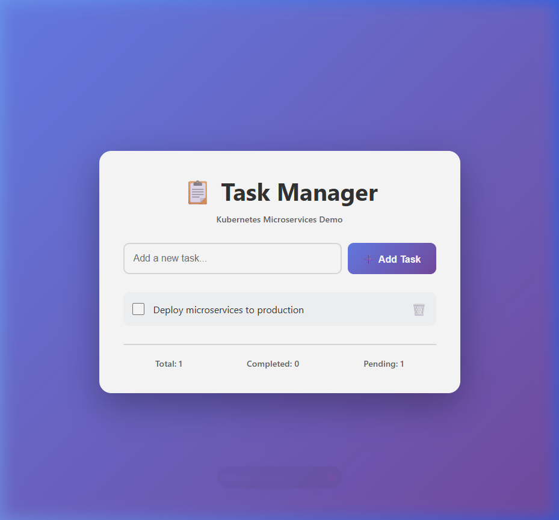

# ☸️ Kubernetes Microservices Deployment

[](https://kubernetes.io)
[](https://www.docker.com)
[](https://www.jenkins.io)
[](https://www.ansible.com)
[](LICENSE)

A **production-grade Kubernetes project** showcasing advanced container orchestration, auto-scaling, network security, RBAC, and CI/CD automation with a full-stack microservices application.

## 📸 Application Demo

The Task Manager application running on Kubernetes:

| Initial State | Task Added |
|:-:|:-:|
|  |  |

## 🏗️ Architecture

```
                    ┌─────────────────────────────┐
                    │     INGRESS CONTROLLER       │
                    │     (nginx-ingress)          │
                    │  /     → Frontend Service    │
                    │  /api/ → Backend Service     │
                    └──────────┬──────────────────┘
                               │
              ┌────────────────┴────────────────┐
              │                                 │
              ▼                                 ▼
    ┌──────────────────┐             ┌──────────────────┐
    │ Frontend Service │             │ Backend Service  │
    │   (NodePort)     │             │   (ClusterIP)    │
    │   Port: 30080    │             │   Port: 8080     │
    └────────┬─────────┘             └────────┬─────────┘
             │                                │
    ┌────────▼─────────┐             ┌────────▼─────────┐
    │  Frontend Pods   │             │  Backend Pods    │
    │  React + Nginx   │             │  Flask + Gunicorn│
    │  Replicas: 3     │             │  Replicas: 2     │
    │  HPA: 2-10       │             │  HPA: 2-8        │
    └──────────────────┘             └────────┬─────────┘
                                              │
                                     ┌────────▼─────────┐
                                     │  PostgreSQL      │
                                     │  (StatefulSet)   │
                                     │  Persistent 10Gi │
                                     └──────────────────┘
```

## 🚀 Key Features

### Kubernetes Resources
| Resource | Details |
|----------|---------|
| **Deployments** | Rolling updates, anti-affinity, health probes |
| **StatefulSet** | PostgreSQL with persistent storage & stable identity |
| **Services** | ClusterIP, NodePort, Headless |
| **Ingress** | Path-based routing with nginx controller |
| **HPA** | Auto-scaling based on CPU (70%) & memory (75-80%) |
| **NetworkPolicies** | Micro-segmentation (frontend→backend→db only) |
| **RBAC** | ServiceAccount, Role, RoleBinding with least privilege |
| **ConfigMaps** | Application configuration management |
| **Secrets** | Encrypted database credentials |
| **ResourceQuotas** | Production namespace limits |
| **Namespaces** | dev, staging, prod environment isolation |

### CI/CD Pipeline
- **Jenkins**: Multi-stage pipeline with parallel builds, approval gates, and automated deployment
- **Ansible**: Automated K8s cluster setup, application deployment, and Jenkins installation
- **Docker Hub**: Images published to [`himanshunaik22/task-frontend`](https://hub.docker.com/r/himanshunaik22/task-frontend) and [`himanshunaik22/task-backend`](https://hub.docker.com/r/himanshunaik22/task-backend)

## 📦 Docker Hub Images

| Image | Pull Command |
|-------|-------------|
| Frontend | `docker pull himanshunaik22/task-frontend:latest` |
| Backend | `docker pull himanshunaik22/task-backend:latest` |

## 📁 Project Structure

```
auto-jenkins-pipeline/
├── README.md                          # This file
├── Makefile                           # Convenient deployment commands
├── .gitignore                         # Comprehensive ignore rules
│
├── app/                               # Application source code
│   ├── frontend/                      # React application
│   │   ├── src/
│   │   │   ├── App.js                 # Task Manager UI component
│   │   │   ├── App.css                # Modern gradient styling
│   │   │   ├── index.js               # React entry point
│   │   │   └── index.css              # Base styles
│   │   ├── public/index.html          # HTML template
│   │   ├── package.json               # Node.js dependencies
│   │   ├── Dockerfile                 # Multi-stage build (Node → Nginx)
│   │   └── nginx.conf                 # Nginx with API proxy + caching
│   │
│   ├── backend/                       # Flask REST API
│   │   ├── app.py                     # CRUD API + health checks + DB retry
│   │   ├── requirements.txt           # Python dependencies
│   │   └── Dockerfile                 # Python slim + gunicorn + non-root
│   │
│   └── docker-compose.yml             # Local development stack
│
├── k8s/base/                          # Kubernetes manifests
│   ├── namespaces/                    # dev, staging, prod (with ResourceQuota)
│   ├── deployments/                   # frontend (3 replicas), backend (2 replicas)
│   ├── statefulsets/                  # PostgreSQL with PVC template
│   ├── services/                      # NodePort, ClusterIP, Headless
│   ├── ingress/                       # Path-based routing (/, /api)
│   ├── configmaps/                    # App configuration (DB host, ports, etc.)
│   ├── secrets/                       # Database credentials (base64)
│   ├── autoscaling/                   # HPA for frontend & backend
│   ├── network/                       # NetworkPolicies (micro-segmentation)
│   └── rbac/                          # ServiceAccount, Role, RoleBinding
│
├── jenkins/                           # CI/CD pipeline
│   ├── Jenkinsfile                    # Declarative pipeline (build→test→push→deploy)
│   └── scripts/
│       ├── build.sh                   # Docker build script
│       └── deploy-to-k8s.sh           # K8s deployment with ordering
│
├── ansible/                           # Infrastructure automation
│   ├── playbooks/
│   │   ├── setup-k8s-cluster.yml      # Install kubectl, minikube, enable addons
│   │   ├── deploy-app.yml             # Deploy app to K8s with smoke tests
│   │   └── setup-jenkins.yml          # Install Jenkins + Docker + kubectl
│   ├── inventory/localhost.ini
│   └── ansible.cfg
│
└── docs/                              # Documentation
    ├── architecture.md                # System design & data flow diagrams
    ├── kubernetes-guide.md            # Deep dive into K8s concepts
    └── deployment-strategies.md       # Rolling, Blue-Green, Canary comparisons
```

## 🛠️ Prerequisites

- [Docker Desktop](https://www.docker.com/products/docker-desktop) (v20+)
- [kubectl](https://kubernetes.io/docs/tasks/tools/) (v1.28+)
- [Minikube](https://minikube.sigs.k8s.io/docs/start/) (v1.30+)

## ⚡ Quick Start

### 1. Start Kubernetes Cluster
```bash
minikube start --cpus=4 --memory=4096 --driver=docker
minikube addons enable ingress
minikube addons enable metrics-server
```

### 2. Build Docker Images (Inside Minikube)
```bash
# Point Docker CLI to Minikube's daemon
eval $(minikube docker-env)          # Linux/Mac
& minikube docker-env --shell powershell | Invoke-Expression   # Windows

# Build images
docker build -t himanshunaik22/task-frontend:latest app/frontend/
docker build -t himanshunaik22/task-backend:latest app/backend/
```

### 3. Deploy to Kubernetes
```bash
# Using Makefile
make deploy-dev

# Or manually
kubectl apply -f k8s/base/namespaces/dev.yaml
kubectl apply -f k8s/base/configmaps/ -n dev
kubectl apply -f k8s/base/secrets/ -n dev
kubectl apply -f k8s/base/rbac/ -n dev
kubectl apply -f k8s/base/statefulsets/ -n dev
kubectl apply -f k8s/base/services/ -n dev
kubectl apply -f k8s/base/deployments/ -n dev
kubectl apply -f k8s/base/ingress/ -n dev
kubectl apply -f k8s/base/autoscaling/ -n dev
kubectl apply -f k8s/base/network/ -n dev
```

### 4. Access the Application
```bash
# Port forward (recommended for Windows/Docker driver)
kubectl port-forward svc/frontend 3000:80 -n dev

# Open: http://localhost:3000
```

### 5. Verify Deployment
```bash
kubectl get pods -n dev              # All pods running
kubectl get svc -n dev               # Services active
kubectl get hpa -n dev               # Auto-scaling active
kubectl get networkpolicies -n dev   # Security policies applied
```

## 🔄 CI/CD Pipeline

### Jenkins Pipeline Stages

```
┌──────────┐   ┌──────────────────┐   ┌──────────┐   ┌──────────────┐
│ Checkout │ → │ Build Frontend & │ → │ Run Tests│ → │ Push to       │
│ Code     │   │ Backend (Parallel)│   │          │   │ Docker Hub    │
└──────────┘   └──────────────────┘   └──────────┘   └──────┬───────┘
                                                              │
┌──────────────┐   ┌──────────────┐   ┌──────────┐   ┌──────▼───────┐
│ Verify       │ ← │ Deploy to    │ ← │ Manual   │ ← │ Deploy to    │
│ Deployment   │   │ Production   │   │ Approval │   │ Staging      │
└──────────────┘   └──────────────┘   └──────────┘   └──────────────┘
```

### Pipeline Features
- ✅ **Parallel builds** for frontend and backend
- ✅ **Automated testing** stage
- ✅ **Docker Hub push** (`himanshunaik22/*`)
- ✅ **Multi-environment deployment** (dev → staging → prod)
- ✅ **Manual approval gate** before production
- ✅ **Deployment verification** with kubectl status checks
- ✅ **Automatic cleanup** of Docker resources

### Setting Up Jenkins
```bash
# Run Ansible playbook
ansible-playbook ansible/playbooks/setup-jenkins.yml

# Or manually install Jenkins and configure:
# 1. Add Docker Hub credentials (ID: docker-hub-credentials)
# 2. Install plugins: Docker, Kubernetes, Pipeline
# 3. Create pipeline job pointing to Jenkinsfile
```

## 🔐 Security

### Network Policies (Micro-segmentation)
```
Internet → Ingress → Frontend pods
                      ↓ (only via API)
                      Backend pods  ← NetworkPolicy: ingress from frontend only
                      ↓ (only DB port)
                      PostgreSQL    ← NetworkPolicy: ingress from backend only
```

### RBAC (Least Privilege)
- **ServiceAccount**: `task-manager-sa`
- **Permissions**: Read-only access to pods, services, configmaps, deployments, statefulsets
- **Scope**: Namespace-level (not cluster-wide)

### Additional Security
- 🔒 Secrets for database credentials
- 🔒 Non-root container user (backend)
- 🔒 Resource quotas in production namespace
- 🔒 Health probes prevent routing to unhealthy pods

## 📊 Auto-Scaling (HPA)

| Service | Min | Max | CPU Target | Memory Target | Scale-Up | Scale-Down |
|---------|-----|-----|------------|---------------|----------|------------|
| Frontend | 2 | 10 | 70% | 80% | 2 pods/30s | 1 pod/5min |
| Backend | 2 | 8 | 70% | 75% | 1 pod/30s | 1 pod/2min |

```bash
# Watch scaling in action
kubectl get hpa -n dev -w

# Stress test (triggers scale-up)
kubectl run load-test --image=busybox --rm -it -- sh -c "while true; do wget -q -O- http://backend:8080/api/tasks; done"
```

## 🗂️ Multi-Environment Setup

| Environment | Namespace | Replicas | Resource Limits | Features |
|-------------|-----------|----------|-----------------|----------|
| **Development** | `dev` | 2-3 | Relaxed | Full debugging |
| **Staging** | `staging` | 2-3 | Moderate | Pre-prod testing |
| **Production** | `prod` | 3-5 | Strict (ResourceQuota) | HA + monitoring |

```bash
# Deploy to different environments
make deploy-dev
make deploy-staging
make deploy-prod
```

## 📝 Useful Commands

```bash
# Cluster Management
minikube start                              # Start cluster
minikube stop                               # Stop cluster
minikube dashboard                          # Open K8s dashboard

# Pod Operations
kubectl get pods -n dev -w                  # Watch pods
kubectl logs deployment/backend -n dev      # View logs
kubectl exec -it postgres-0 -n dev -- psql -U postgres -d taskdb  # DB shell

# Deployment Operations
kubectl rollout status deployment/frontend -n dev    # Check rollout
kubectl rollout undo deployment/frontend -n dev      # Rollback
kubectl rollout history deployment/frontend -n dev   # History

# Scaling
kubectl scale deployment/frontend --replicas=5 -n dev  # Manual scale
kubectl get hpa -n dev -w                               # Watch auto-scaling

# Debugging
kubectl describe pod <pod-name> -n dev      # Pod details
kubectl get events -n dev --sort-by='.lastTimestamp'  # Events
kubectl top pods -n dev                     # Resource usage
```

## 📚 Documentation

| Document | Description |
|----------|-------------|
| [Architecture Guide](docs/architecture.md) | System design, data flow, HA strategies |
| [Kubernetes Deep Dive](docs/kubernetes-guide.md) | K8s concepts, troubleshooting, best practices |
| [Deployment Strategies](docs/deployment-strategies.md) | Rolling, Blue-Green, Canary with examples |

## 🛠️ Built With

| Technology | Purpose |
|-----------|---------|
| **Kubernetes** | Container orchestration & scaling |
| **Docker** | Containerization (multi-stage builds) |
| **Jenkins** | CI/CD pipeline automation |
| **Ansible** | Infrastructure automation |
| **React** | Frontend UI framework |
| **Flask** | Backend REST API |
| **PostgreSQL** | Relational database |
| **Nginx** | Reverse proxy & static file serving |
| **Gunicorn** | Python WSGI HTTP server |

## 🎓 Learning Outcomes

This project demonstrates proficiency in:

1. **Kubernetes Orchestration** — Deployments, StatefulSets, HPA, RBAC, NetworkPolicies
2. **Container Technology** — Multi-stage Docker builds, image optimization
3. **CI/CD Automation** — Jenkins declarative pipelines with multi-environment deploy
4. **Infrastructure as Code** — Ansible playbooks for cluster and app provisioning
5. **Security** — Network segmentation, RBAC, secrets management, non-root containers
6. **High Availability** — Multi-replica deployments, anti-affinity, auto-scaling
7. **Observability** — Health probes, resource monitoring, centralized logging strategy

## 📄 License

This project is licensed under the MIT License - see the [LICENSE](LICENSE) file for details.

---

**Made with ❤️ by Himanshu Naik** | [Docker Hub](https://hub.docker.com/u/himanshunaik22)
